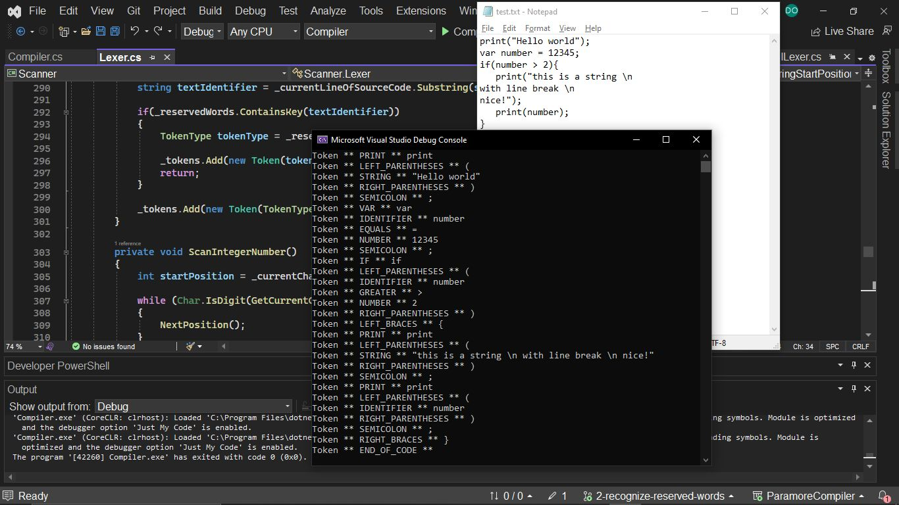

# Paramore Compiler

ParamoreCompiler é um compilador desenvolvido em C#. 

O projeto está organizado em modulos e tem como objetivo aprender sobre e aplicar conceitos como análise léxica, análise sintática e geração de código. O diferencial desse projeto vem do fato de usar titulos de músicas da banda Paramore como palavras-chave.

Esse projeto ainda está em andamento.

### Tecnologias Utilizadas:

- C#
- .NET

## Features

- [x] Scanner
- Geração de tokens a partir de uma arquivo de texto:

- [ ] Parser
